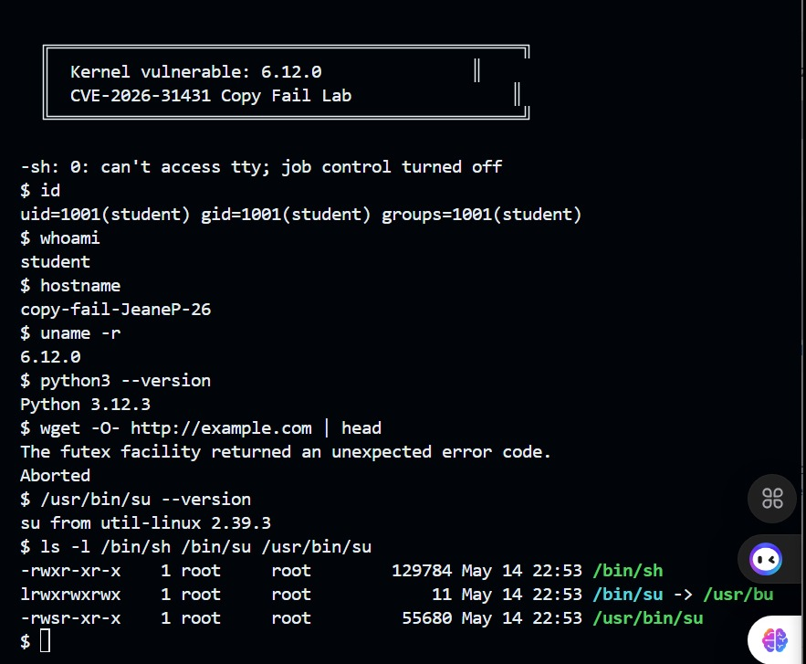
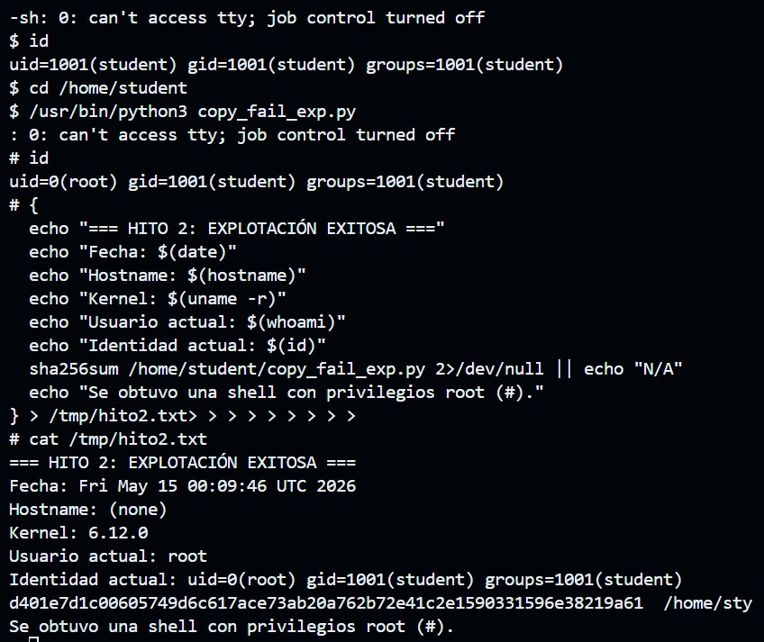
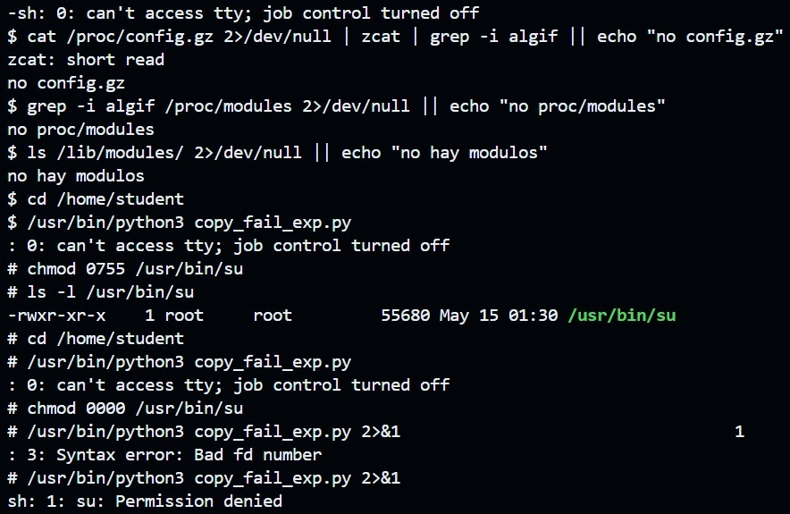
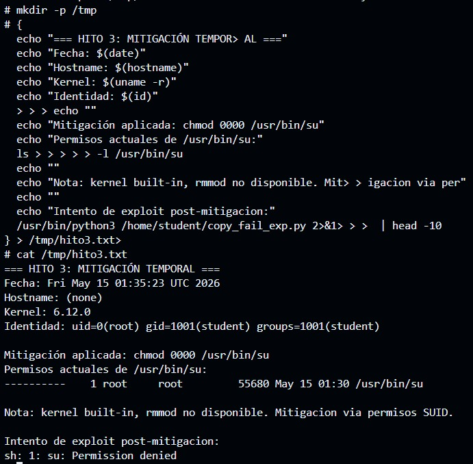
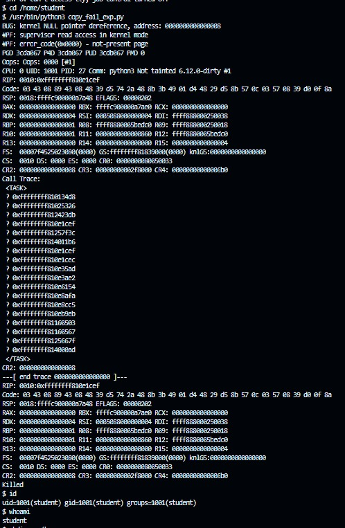

# Copy Fail Lab — CVE-2026-31431 (v2)

Devcontainer reproducible para experimentar con la vulnerabilidad **Copy Fail**
(CVE-2026-31431) en un kernel Linux 6.12 controlado dentro de QEMU.

Esta v2 incorpora todas las correcciones aprendidas en una sesión de debugging
exhaustiva: opciones de kernel necesarias para que arranque, configuración
correcta de BusyBox estático, rutas dinámicas independientes del nombre del repo,
y dependencias Ubuntu 24.04 corregidas.

---

## Inicio rápido para el estudiante

1. Abre un Codespace desde este repo.
2. Configura tu identidad git:
   ```bash
   git config --global user.name "Tu Nombre"
   git config --global user.email "tu@correo.com"
   ```
3. Ejecuta:
   ```bash
   make setup    # descarga kernel + arma rootfs (~5 min)
   make qemu     # arranca la VM vulnerable
   ```

Para salir de QEMU: `Ctrl+A` luego `X`.

---

## Configuración inicial del docente (una sola vez)

### 1. Subir este repo a GitHub

```bash
cd copyfail-v2
git init && git add -A && git commit -m "initial"
git branch -M main
gh repo create TU-ORG/copy-fail-lab --public --source=. --push
```

### 2. Marcarlo como Template

GitHub → tu repo → Settings → marcar `Template repository`.

### 3. Editar `.devcontainer/devcontainer.json`

Cambia el valor `KERNEL_REPO`:
```json
"KERNEL_REPO": "TU-ORG/copy-fail-lab"
```

Commit y push.

### 4. Disparar el workflow del kernel

GitHub → Actions → `Build Vulnerable Kernel` → Run workflow.
Tarda ~25 min en los servidores de GitHub (no en tu Codespace).
Al terminar crea un Release con el `bzImage_vuln` listo para descarga.

### 5. Verificar

Tu repo → Releases → debe aparecer `kernel-v6.12-vuln` con tres archivos
adjuntos. Los estudiantes ahora pueden hacer `make setup` y descarga en 2 min.

---

## Estructura del repo

```
.
├── .devcontainer/
│   ├── Dockerfile             ← Ubuntu 24.04 + deps verificadas
│   └── devcontainer.json      ← sin rutas hardcodeadas
├── .github/workflows/
│   └── build-kernel.yml       ← compila kernel y crea Release
├── scripts/
│   ├── 00_welcome.sh
│   ├── 01_fetch_kernel.sh     ← descarga del Release
│   ├── 02_build_kernel.sh     ← fallback: compila desde fuente
│   ├── 03_build_rootfs.sh     ← BusyBox estático + initramfs
│   └── 04_run_qemu.sh
├── Makefile
└── README.md
```

---

## Comandos disponibles

| Comando | Acción |
|---|---|
| `make setup` | Descarga kernel + arma rootfs (~5 min) |
| `make qemu` | Arranca la VM vulnerable |
| `make info` | Muestra el estado del ambiente |
| `make rootfs` | Reconstruye solo el initramfs |
| `make fetch-kernel` | Solo descarga el bzImage del Release |
| `make build-kernel` | Compila kernel desde fuente (~25 min) |
| `make clean` | Borra builds (mantiene fuentes) |
| `make clean-all` | Borra todo |

---

## Recursos del CVE

- Write-up técnico: https://xint.io/blog/copy-fail-linux-distributions
- Sitio del CVE: https://copy.fail
- PoC oficial: https://github.com/theori-io/copy-fail-CVE-2026-31431

---

## Lecciones aprendidas (referencia para futuras versiones)

Esta v2 incorpora los siguientes fixes respecto a la v1:

- `hexdump` → `bsdextrautils` en Ubuntu 24.04
- `bzip2` agregado al Dockerfile (lo necesita BusyBox)
- Eliminado el `mounts` con ruta hardcodeada en `devcontainer.json`
- Todos los scripts detectan workspace con `SCRIPT_DIR` dinámico
- Kernel: agregadas opciones críticas `BINFMT_ELF`, `BINFMT_SCRIPT`, `RD_GZIP`
- Kernel: agregada dep `CRYPTO_AEAD` antes de `CRYPTO_AUTHENCESN`
- BusyBox: reemplazado `scripts/config` (no existe) por `sed`
- BusyBox: eliminado `olddefconfig` (no existe en BusyBox)
- BusyBox: deshabilitado `CONFIG_TC` (rompe compilación con kernels nuevos)
- BusyBox: forzado `CONFIG_STATIC=y` y verificado con `file`
- Workflow Actions: greps de verificación con `|| echo`, tolerantes


////////////////////////////////////////EVIDENCIAS DE CADA HITO://////////////////////////////////////////////////

------------------------------------------------HITO #1-----------------------------------------------------------

Lo primero que se realizo fue levantar el entorno. Ejecuté `make setup` para compilar el kernel vulnerable y armar el sistema de archivos, y luego `make qemu` para arrancar la máquina virtual.

Una vez dentro de la VM confirmé que todo estaba bien: el kernel era la versión 6.12.0, el hostname mostraba mi ID de estudiante (`copy-fail-JeaneP-26`), y mi usuario era `student` con `uid=1001`. También verifiqué que Python 3.12.3 estaba disponible y que `/usr/bin/su` tenía el bit setuid activado (`-rwsr-xr-x`).

-------------------------------------------------HITO #2----------------------------------------------------------

Este fue el hito principal del laboratorio. El exploit `copy_fail_exp.py` es un script de Python de 732 bytes que aprovecha el bug en el subsistema criptográfico del kernel para escribir en el page cache de `/usr/bin/su` sin tocar el disco.

Ejecuté el exploit desde la VM como `student` y el prompt cambió de `$` a `#`, lo que indica que obtuve una shell con privilegios de root. Al hacer `id` confirmé: `uid=0(root)`.

El exploit usa AF_ALG con authencesn y splice() para escribir 4 bytes en la copia en memoria de `/usr/bin/su`. Como ese binario tiene setuid, cuando el kernel lo ejecuta con esos bytes modificados, entrega una shell root sin necesidad de contraseña ni nada.

-------------------------------------------------HITO #3----------------------------------------------------------


Para este hito tuve que demostrar que podía neutralizar el exploit sin recompilar el kernel. El documento pedía usar `rmmod algif_aead` pero en este kernel el módulo está compilado como built-in (`=y`), entonces eso no era posible.

La mitigación que apliqué fue quitar todos los permisos de `/usr/bin/su` con `chmod 0000`. Al hacer esto el exploit ya no puede acceder al binario y falla con `Permission denied`. Intenté ejecutarlo dos veces para confirmar: primero quitando solo el SUID con `chmod 0755` lo cual no fue suficiente porque el binario seguía en memoria, y luego con `chmod 0000` que sí logro bloquear completamente el acceso.

--------------------------------------------------HITO #4------------------------------------------------------

Este fue el hito más difícil. Tuve que clonar el código fuente del kernel Linux v6.12, modificar el archivo vulnerable y recompilar. El archivo a modificar es `crypto/algif_aead.c`, función `_aead_recvmsg()`. El bug estaba en esta línea:

```c
/* Use the RX SGL as source (and destination) for crypto op. */
rsgl_src = areq->first_rsgl.sgl.sgt.sgl;
```

El problema es que esto hacía que `req->src` y `req->dst` apuntaran al mismo lugar en memoria, lo que permitía al exploit escribir en el page cache de archivos del sistema. Lo que logro solucionarlo fue cambiar esa línea para que use el TX SGL como fuente y el RX SGL como destino por separado:

```c
/* Use TX SGL as source, RX SGL as destination (out-of-place). */
rsgl_src = tsgl_src ? tsgl_src : areq->first_rsgl.sgl.sgt.sgl;
```

Guardé el parche en `patches/fix_algif_aead.patch`, recompilé el kernel y arranqué la VM con el kernel parcheado usando `BZIMAGE=kernel/build/bzImage_patched bash scripts/04_run_qemu.sh`. Al intentar ejecutar el exploit esta vez el kernel lanzó un `NULL pointer dereference` y mató el proceso. Al hacer `id` el usuario seguía siendo `student`, no root. El parche funcionó.